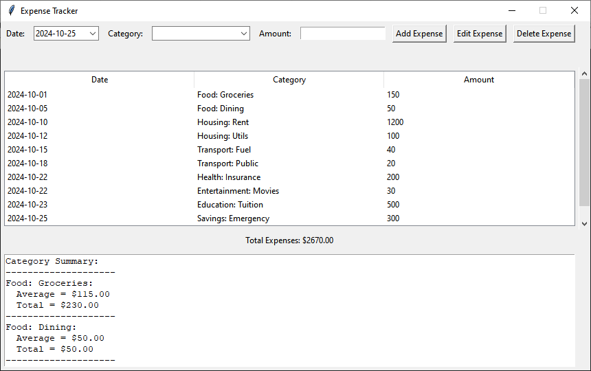

# Expense Tracker



## Description

The Expense Tracker is a simple GUI application designed to help users manage and track their expenses. Built with Python's Tkinter library, it provides a user-friendly interface for adding, editing, and deleting expenses, as well as visualizing category summaries and total expenditures.

## Features

- **Add Expenses**: Quickly input your expenses with date, category, and amount.
- **Edit Expenses**: Modify existing expenses easily.
- **Delete Expenses**: Remove expenses that are no longer needed.
- **View Expenses**: Display a list of all recorded expenses in a clear format.
- **Category Summary**: Automatically calculates and displays totals and averages for each expense category.
- **CSV Export**: Saves all expenses to a CSV file for easy data management and backup.
- **Sorting**: Sort expenses by date, category, or amount.


## Requirements

- Python 3.x
- Tkinter (comes pre-installed with Python)
- `tkcalendar` library for date selection
### Installation

1. **Navigate to the project directory**:

   ```bash
   cd expense_tracker
   ```

2. **Install the required libraries** (if necessary):

   ```bash
   pip install tkcalendar
   ```

## Usage

1. Run the application:

   ```bash
   python expense_tracker.py
   ```

2. Use the interface to add, edit, or delete your expenses.

3. Expenses are saved in a CSV file named `finances.csv` in the project directory.

## Example of Categories

The application comes with predefined categories for easier tracking. Here are some examples:

- Food: Groceries
- Food: Dining
- Housing: Rent
- Housing: Utilities
- Transportation: Fuel
- Transportation: Public
- Healthcare: Insurance
- Entertainment: Movies
- Education: Tuition
- Savings: Emergency

## Contributing

Contributions are welcome!

## Acknowledgments

Thank you to the developers of Python, Tkinter, and the `tkcalendar` library for making this project possible.

